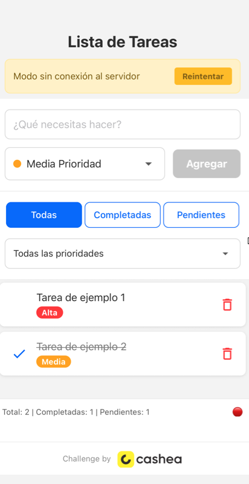

# 📝 TODO App – Challenge by Cashea



Aplicación de lista de tareas desarrollada en **Expo React Native**, como parte del **challenge técnico de Cashea**.  
Permite crear, completar, eliminar y filtrar tareas por prioridad, con un modo **offline** que garantiza funcionalidad incluso sin conexión al servidor.  
Utiliza un **servidor mock con [json-server](https://github.com/typicode/json-server)** para simular las peticiones REST al backend.

---

## 🚀 Tecnologías principales

- [Expo](https://expo.dev/) (React Native)
- [Zustand](https://github.com/pmndrs/zustand) para el manejo de estado global
- [React Navigation](https://reactnavigation.org/) para la navegación
- [json-server](https://github.com/typicode/json-server) como API simulada
- AsyncStorage para persistencia local
- Estilos con `StyleSheet` y componentes nativos

---

## ⚙️ Configuración del proyecto

Cloná el repositorio:

```bash
git clone https://github.com/Martin-Cornejo_Comafi/TODO-ByCashea.git
cd TODO-ByCashea
```

Instalá las dependencias:

```bash
npm install
# o
yarn install
```

---

## ▶️ Ejecución del proyecto

### 1. Iniciar el servidor (json-server)

El proyecto usa **json-server** para simular un backend local.  
Podés iniciarlo con:

```bash
npx json-server --watch db.json --port 3001
```

> ⚠️ Si no tenés el archivo `db.json`, creá uno en la raíz del proyecto con la siguiente estructura:
```json
{
  "tasks": [
    { "id": 1, "title": "Tarea de ejemplo 1", "priority": "Alta", "completed": false },
    { "id": 2, "title": "Tarea de ejemplo 2", "priority": "Media", "completed": true }
  ]
}
```

### 2. Iniciar la app móvil

#### iOS
```bash
npx expo run:ios
```

#### Android
```bash
npx expo run:android
```

#### App (opcional)
```bash
npx expo start
```

---

## 📦 Dependencias principales

| Paquete | Versión | Descripción |
|----------|----------|-------------|
| expo | ^52.x | Framework React Native |
| react-native | ^0.76.x | Core de la app |
| zustand | ^5.x | Estado global simple y eficiente |
| @react-navigation/native | ^7.x | Navegación |
| @react-navigation/stack | ^7.x | Navegación tipo stack |
| @react-native-async-storage/async-storage | ^2.x | Persistencia local |
| json-server | ^1.x | Servidor mock para desarrollo |

---

## 🌐 Modo sin conexión (feature)

La app detecta automáticamente si no hay conexión al servidor y muestra un **banner amarillo** con el mensaje:

> “Modo sin conexión al servidor”

Durante este modo:
- Las tareas se guardan y actualizan localmente usando AsyncStorage.  
- El botón “Reintentar” permite volver a sincronizar cuando hay conexión.  
- Si el `json-server` está apagado, se activa automáticamente el modo offline.

---

## 🧠 Manejo de estado – Zustand

Se eligió **Zustand** por su simplicidad, bajo consumo y excelente integración con React Native.  
Permite:
- Manejar el listado global de tareas sin necesidad de Contexts anidados.
- Persistir el estado fácilmente.
- Reducir re-renderizados innecesarios.

---

## ⚠️ Supuestos y trade-offs

- Se asume que el backend podría no estar disponible, por lo que el modo offline es esencial.  
- No se implementó autenticación ni sincronización remota avanzada.  
- Se priorizó **UX simple y fluida** sobre características avanzadas.  
- La prioridad de las tareas es estática (Alta, Media, Baja).

---

## 🐞 Conocidas Limitaciones

- La sincronización con servidor es simulada (json-server local).  
- En algunos dispositivos Android antiguos, la animación del “check” puede tener un ligero retraso.  

---

## 👨‍💻 Autor

**Martín Cornejo**  
[GitHub – Martin Cornejo](https://github.com/martincornejo92)

---

**Challenge by [Cashea](https://cashea.co)** 💛
